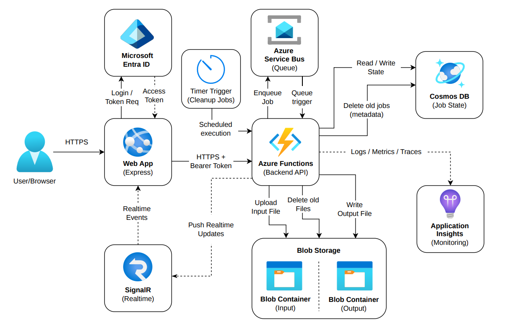
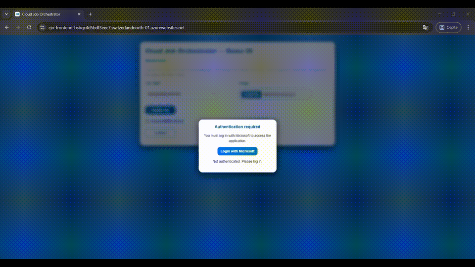
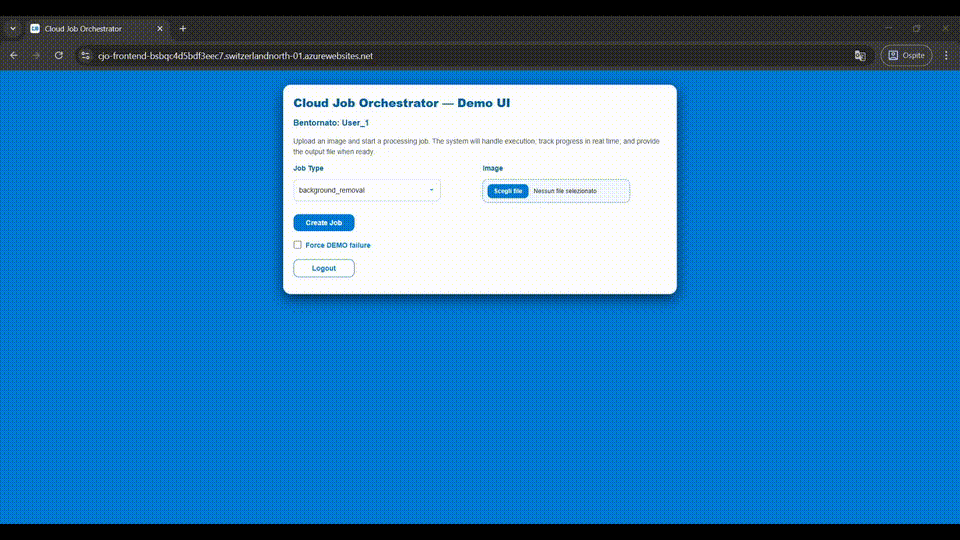

<p align="center">
  
</p>

<h1 align="center">Cloud Job Orchestrator</h1>

<p align="center">
  <b>Event-driven</b> system for resilient orchestration of asynchronous jobs on Azure
</p>

<p align="center">
  <i>
    Decoupled, scalable and resilient architecture for asynchronous workloads
  </i>
</p>

<p align="center">
  
  
  
  
</p>

<p align="center">
  
  
  
  
  
</p>

## Table of Contents

- [Cloud Job Orchestrator](#cloud-job-orchestrator)
- [High-Level Architecture](#high-level-architecture)
- [End-to-End Workflow](#end-to-end-workflow)
- [Main Features](#main-features)
  - [Available Jobs](#available-jobs)
- [Azure Services Used and Why](#azure-services-used-and-why)
- [Implementation Details](#implementation-details)
- [Why This Architecture](#why-this-architecture)
- [Project Assumptions](#project-assumptions)
- [Demo and Visual Materials](#demo-and-visual-materials)
- [Troubleshooting](#troubleshooting)
- [How to Run the Project Locally](#how-to-run-the-project-locally)
- [How to Deploy from Scratch](#how-to-deploy-from-scratch)
- [Current Limitations and Future Developments](#current-limitations-and-future-developments)
- [License and Credits](#license-and-credits)

## Cloud Job Orchestrator

**Cloud Job Orchestrator** is an **event-driven** system for orchestrating asynchronous jobs — not the classic synchronous "upload + processing" app.

The project addresses a specific problem: resiliently managing asynchronous jobs by clearly separating:

- **intake** (request acceptance, validation, state persistence);
- **execution** (processing in a separate worker);
- **centralized state** on a dedicated datastore;
- **decoupling via queue** between API and worker.

This approach enables:

- **non-blocking** job submission on the client side;
- **at-least-once** behavior with message retry;
- horizontal scaling of workers;
- peak absorption through queue buffering;
- end-to-end state tracking with real-time updates and polling fallback.

The implemented use case is the orchestration of asynchronous image jobs with output persisted on Blob Storage, state monitoring in the UI and real-time notifications per user/job.
The two current jobs (**background removal** and **image upscale**) are concrete examples of a more general pipeline: the main focus of the project is the architecture that supports them, not the individual processing algorithm.

## High-Level Architecture

Main components present in the repository:

1. **Frontend Web App (Express)**
    - Node/Express server that serves the interface and runtime configuration (`/config.js`).
    - UI for authentication, job creation, state monitoring and output download.
2. **Backend API (Azure Functions HTTP)**
    - Job creation endpoint (`POST /jobs`), status (`GET /jobs/{id}`), output link (`GET /jobs/{id}/output-link`) and real-time negotiation (`/realtime/negotiate`).
3. **Worker (Azure Functions Service Bus trigger)**
    - Consumes messages from the `q-jobs` queue, performs processing, updates state, publishes real-time events.
4. **Cosmos DB (source of truth)**
    - Job state and metadata (status, progress, attempts, input/output reference, error, timestamps).
5. **Azure Service Bus**
    - Decoupling queue between intake and execution, with at-least-once semantics.
6. **Blob Storage**
    - Persistence of input/output files and generation of temporary download links.
7. **Azure SignalR**
    - Real-time push of state/progress/log events to the client associated with the user.
8. **Microsoft Entra ID**
    - Authentication and JWT token validation for API access.
9. **Cleanup timer**
    - Function scheduled every 15 minutes to remove completed jobs beyond the time threshold and associated blobs.
10. **Application Insights (observability)**
    - Collection of logs, metrics and traces for runtime monitoring and debugging.
    - Used for error analysis, performance and system behavior.

### Cloud Job Orchestrator – High-Level Architecture

<p align="center">
  
</p>

## End-to-End Workflow

1. **Job creation from UI**
    - Authenticated user selects job type and image file.
2. **API validation**
    - Token verification, supported job type, file presence.
3. **Input upload**
    - The file is uploaded to the Blob input container.
4. **Initial state persistence**
    - A job document is created in Cosmos DB (status `queued`).
5. **Enqueue**
    - API publishes a lightweight message to Service Bus (claim-check: identifiers, not full payload).
6. **Processing worker**
    - Worker reads the message, loads input from Blob, applies transformation, uploads output to Blob.
7. **State update**
    - Cosmos is progressively updated (`processing` → `done` or `failed`, with progress/attempts/error).
8. **Real-time notifications**
    - SignalR events sent to the user client (`status`, `progress`, `log`, `completed`).
9. **Polling fallback**
    - If real-time is not available, the frontend continues monitoring via API polling.
10. **Final download**
    - UI requests `output-link`; backend generates a temporary SAS URL to download the output.

## Main Features

Actually implemented capabilities:

- user authentication via Entra ID;
- creation of asynchronous jobs via API;
- job state monitoring (queued/processing/done/failed);
- output management with temporary download link;
- support for multiple `job type`;
- retry/at-least-once processing behavior based on queue;
- progress updates during execution;
- periodic cleanup of completed jobs;
- automatic real-time → polling fallback on the frontend side.

### Available Jobs

1. **background_removal**
    - Uses `rembg` with a reusable session on the worker side.
    - The image is converted and saved in **PNG** (`image/png`).

2. **image_upscale**
    - Uses Pillow with LANCZOS resize (currently 2x factor).
    - Attempts to preserve the original format when available.

## Azure Services Used and Why

- **Azure Functions**
  - Role: HTTP API, queue-trigger worker, cleanup timer.
  - Why: serverless model, natural separation of triggers and managed scaling.
- **Azure Service Bus**
  - Role: `q-jobs` job queue.
  - Why: decouples intake from execution, buffers peaks, enables at-least-once retry.
- **Azure Cosmos DB**
  - Role: job state and metadata.
  - Why: low-latency operational datastore, used as **source of truth**.
- **Azure Blob Storage**
  - Role: input/output persistence and download via temporary SAS.
  - Why: storage suitable for binary payloads, separate from metadata.
- **Azure App Service / Web App**
  - Role: Express frontend hosting.
  - Why: simple UI delivery with configuration via app settings.
- **Azure SignalR Service**
  - Role: real-time push of job events to specific users.
  - Why: near-real-time updates without continuous polling, with fallback when needed.
- **Microsoft Entra ID**
  - Role: identity provider for login and API protection via bearer token.
  - Why: centralized identity/claims management in an Azure context.
- **Application Insights**
  - Role: telemetry and runtime observability.
  - Why: supports operational tuning (e.g. worker concurrency, failure/performance analysis).

Best practices applied in the design:

- claim-check pattern in messages;
- decoupling via message queue;
- at-least-once processing + consumer idempotency;
- separation of serverless triggers by responsibility;
- state persisted as source of truth;
- real-time push with polling fallback.

Synthetic example of a job document in Cosmos DB:

```json
{
  "id": "4f0f3a22-8f2f-4d11-9b3c-4bc29a0d8d77",
  "pk": "a2d7c4d1-3b9e-4d62-8aa1-2f0c0f1f8f44",
  "type": "background_removal",
  "status": "processing",
  "progress": 0.7,
  "attempts": 1,
  "createdAt": "2026-03-31T10:15:20.120000+00:00",
  "updatedAt": "2026-03-31T10:15:42.980000+00:00",
  "correlationId": "f6a6f7cf-6e4f-4d6a-9e81-3d8584df9f18",
  "inputRef": { "container": "input", "blobName": "<pk>/<jobId>/image.jpg" },
  "outputRef": { "container": "output", "blobName": "<pk>/<jobId>/image.png" },
  "error": null,
  "parameters": { ... }
}
```

## Implementation Details

The project is structured in separate modules and services, not as a monolithic demo:

- backend organized into `src/shared/` (cross-cutting utilities) and `src/services/` (application logic);
- clear separation between API (`create/get status/output-link`) and worker (`process_job_message`);
- claim-check pattern: only references are passed in the Service Bus message (`jobId`, `pk`, `type`, `correlationId`);
- worker operational idempotency: if it finds a terminal state (`done`/`canceled`) it skips re-execution;
- error handling with `failed` state persistence and error payload (`code`, `message`, `stage`);
- intermediate progress tracking (`0.1`, `0.4`, `0.7`, `0.9`, `1.0`) with real-time events;
- automatic cleanup of `done` jobs older than 1 hour, with deletion of input/output blobs;
- real-time heartbeat during long operations to avoid "silence" on the client side.

Relevant operational choice: in `backend/host.json` the Service Bus trigger uses **`maxConcurrentCalls: 2`** per instance. This configuration was maintained after tests/observations on Application Insights to reduce resource saturation and prevent instability/crashes of individual instances when jobs are heavy (e.g. image processing with native libraries).

## Why This Architecture

Main trade-off: preferring decoupling and operational robustness over a simple synchronous pipeline.

Practical benefits:

- **decoupling** of UI/API from processing;
- **resilience** to temporary errors with message retry;
- **scalability** of workers based on load;
- **isolation** of jobs and the processing runtime;
- **peak management** via queue;
- **reduction of coupling** between user experience and actual processing times.

## Project Assumptions

- The UI is designed for relatively fast jobs and for real-time operational monitoring.
- The system is oriented towards one-shot usage: job creation, waiting for the result and download, without the need for subsequent consultation.
- No persistent job history is expected on the frontend side after a full refresh.
- The focus is on resilient orchestration of asynchronous jobs, not on archiving or historical management of results.
- Backend persistence (Cosmos DB, Blob Storage) is used for orchestration and tracking during execution, not as permanent storage for long-term user consultation.


## Demo and Visual Materials

**Slide della presentazione**
[Cloud Job Orchestrator – Presentazione](assets/Cloud Job Orchestrator_Demo_ Presentation.pdf)

### Video Demo

**Authentication and access**  

[](assets/video-autenticazione-entra-id.mp4)

**Creating a Job (background removal)**  

[](assets/video-background-remove.mp4)


## Troubleshooting

- **First frontend startup is slower**
  - The Express server may require initial warm-up time.
- **First Functions startup is slower**
  - Cold start + runtime/library loading (in particular `rembg`) may increase initial latency.
- **Intentional demo latency**
  - The worker can introduce a configurable delay (`WORKER_DELAY_SECONDS`) to better visualize transitions in demo.
- **Login/token issues**
  - Verify consistency of Entra ID configurations: tenant, client ID, audience, scope and app registration.
- **Deploy/config issues**
  - Use `infra/README.md` and `infra/` scripts for diagnosis (parameters, app settings, prerequisites).
- **Worker concurrency and stability**
  - In case of saturation or runtime errors under load, verify the `maxConcurrentCalls: 2` setting in `backend/host.json` — a choice introduced after observations on Application Insights (with higher values I observed instability on heavy jobs).

## How to Run the Project Locally

### 1) Prerequisites

- Azure Functions Core Tools
- Python 3 + pip
- Node.js + npm
- Azure CLI (`az`)
- To run the complete flow with Azure infrastructure: follow the instructions in [infra/README.md](infra/README.md)

### 2) Variable Configuration

1. Backend:
   ```bash
   cp backend/local.settings.example.json backend/local.settings.json
   ```
2. Frontend:
   ```bash
   cp .env.example .env
   ```
3. Populate real values (API base URL, Entra ID, backend connections).

Practical tip: after infrastructure deployment use `infra/setup-env.sh` to extract values from App Settings.

### 3) Backend startup

From `backend/`:

```bash
python -m venv .venv
source .venv/bin/activate
pip install -r requirements.txt
func start
```

### 4) Frontend startup

From `frontend/`:

```bash
npm install
npm start
```

The Express frontend exposes the UI (local port from `PORT`, default `3000`).

### 5) Quick demo test

1. Microsoft login from the UI.
2. Select `background_removal` or `image_upscale`.
3. Upload image and create job.
4. Verify state/progress transitions (real-time or polling fallback).
5. Download output with the dedicated button when the state is `done`.

## How to Deploy from Scratch

The official provisioning and deployment flow is in the [infra/](infra/) folder

- Resource provisioning: `infra/deploy.sh` + `infra/bicep/main.bicep`
- Environment parameters: `infra/bicep/parameters*.json`
- Runtime variable extraction: `infra/setup-env.sh`
- Complete operational instructions: **`infra/README.md`**

This README does not duplicate the infrastructure guide: for deployment from scratch follow [infra/README.md](infra/README.md) directly.

## Current Limitations and Future Developments

Natural evolutions of the project:

- support for more input types and advanced validations;
- more realistic processing pipeline (multi-step, chaining, policy);
- full multi-tenant with isolation/quota logic;
- advanced observability (business metrics + in-depth distributed tracing);
- historical job persistence on the frontend or dedicated datastore for long-term consultation;
- evolution from a flow oriented towards fast jobs towards a more complete operational platform.

## License and Credits

- **License**: This project is released under the Unlicense. For full details, refer to the `LICENSE` file.
- **Technical credits**:
  - Azure Functions, Service Bus, Cosmos DB, Blob Storage, SignalR, App Service;
  - Python libraries used in processing: `rembg`, `Pillow`.
